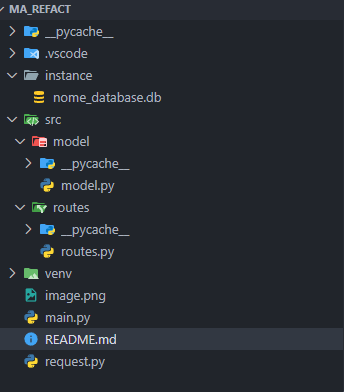
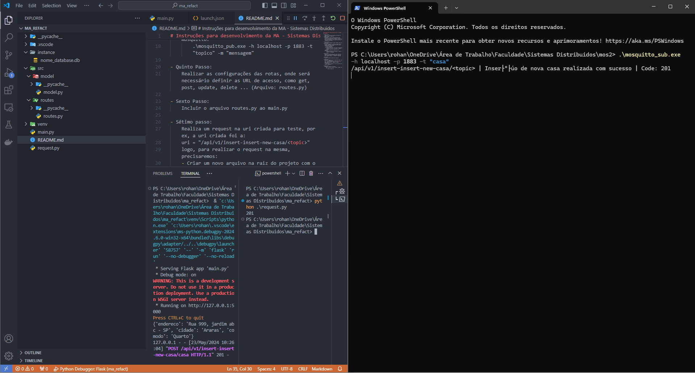

# MA - Sistemas Distribuídos

Este projeto é uma aplicação web desenvolvida com Flask, SQLAlchemy e MQTT, voltada para o gerenciamento de casas, cômodos e sensores em um ambiente distribuído. O sistema permite o cadastro de casas, organização de cômodos e sensores, além de integração com um broker MQTT para publicação de eventos.

## Funcionalidades
- Cadastro de casas e seus respectivos cômodos
- Cadastro de sensores e associação a cômodos
- Relacionamento entre casas, cômodos e sensores
- API RESTful para inserção de dados
- Integração com broker MQTT (Mosquitto) para publicação de eventos

## Estrutura do Projeto
```
├── main.py                # Inicialização do Flask, banco de dados e MQTT
├── src/
│   ├── model/
│   │   └── model.py       # Definição das tabelas: Casa, Comodo, Sensor
│   └── routes/
│       └── routes.py      # Rotas da API
├── request.py             # Exemplo de requisição para testar a API
├── instance/              # Pasta gerada pelo SQLite
├── Organizacao_Pastas_Arquivos.png
├── Retorno_Esperado.png
└── README.md
```

## Como executar

### 1. Instale as dependências
Recomenda-se o uso de um ambiente virtual:
```bash
python -m venv venv
source venv/bin/activate  # Linux/Mac
venv\Scripts\activate    # Windows
pip install flask flask_sqlalchemy paho-mqtt
```

### 2. Inicie o broker MQTT (Mosquitto)
Certifique-se de que o Mosquitto está instalado e rodando:
```bash
mosquitto -v
```

### 3. Execute a aplicação
```bash
python main.py
```
Isso irá criar o banco de dados SQLite e inicializar o servidor Flask.

### 4. Teste a API
Utilize o arquivo `request.py` para enviar requisições de teste:
```bash
python request.py
```

## Exemplo de uso da API
- **Inserir nova casa:**
  - Endpoint: `/api/v1/insert-insert-new-casa/<topic>`
  - Método: `POST`
  - Corpo (JSON):
    ```json
    {
      "endereco": "Rua Exemplo, 123",
      "cidade": "Cidade Exemplo"
    }
    ```
  - O sistema irá salvar a casa no banco e publicar uma mensagem no tópico MQTT informado.

## Imagens de referência
- Organização dos arquivos:
  
- Exemplo de retorno esperado:
  

## Requisitos
- Python 3.8+
- Flask
- Flask-SQLAlchemy
- paho-mqtt
- Mosquitto (broker MQTT)

